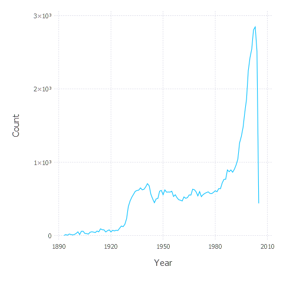
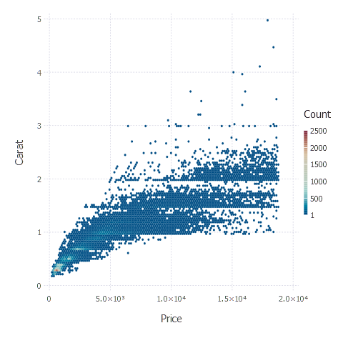
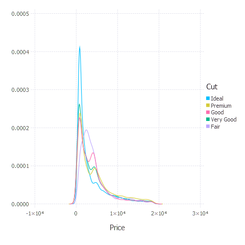
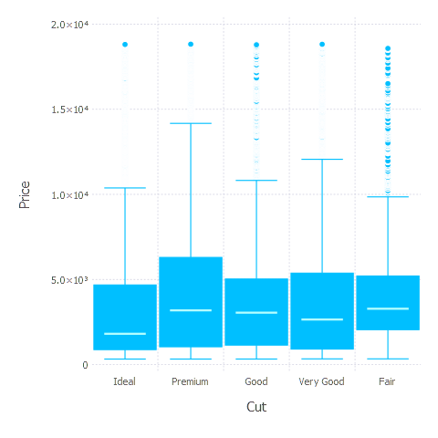
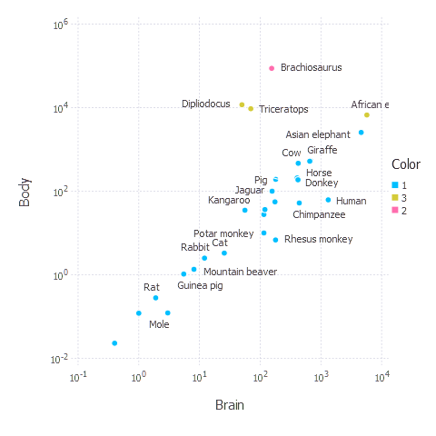

Julia for Data Science
================

[Exploring JULIA's power in doing Data Science ...](https://github.com/MNoorFawi/julia-for-data-science)
-------------------------------------------------

### <https://julialang.org/>

#### What is and Why Julia ?!

###### Julia is a high-level general-purpose dynamic programming language, that was originally designed to address the needs of high-performance numerical analysis and computational science, without the typical need of separate compilation to be fast.

###### Julia is FAST. Julia was designed from the beginning for high performance and GPU acceleration. It's General, Dyamic and fast-growing, its community is expanding magnificently.

##### One beautiful thing about Julia is that its syntax resembles that of R. and as an R lover, I have begun to love Julia ...
###### N.B. we'll be using Julia version 0.6.4

Here we're going to explore some of what can be done in Data Science with Julia.

First we need to install and load some Julia Packages.

``` julia
Pkg.add("DataFrames")
Pkg.add("Query")
# .....

using DataFrames, Query, Knet, Gadfly,
  Cairo, Clustering, RDatasets
```

### Exploring, Manipulating and Visualizing Data

Julia has a data structure called [**DataFrame**](http://juliadata.github.io/DataFrames.jl/stable/index.html) which is similar to R's and pandas' data frame. Julia's DataFrame behaves in the same way as other languages dataframes with method for slicing, changing, reshaping etc. and has a package called [**Query**](http://www.queryverse.org/Query.jl/stable/) that can be used to manipulate it with **SQL**-like syntax. Query is very beautiful and it reminds me of R's **dplyr**. Julia also has [**Gadfly**](http://gadflyjl.org/stable/index.html) which is a package built on top of **R's ggplot2** that can be used for data visualization.

###### We will use some R datasets to explore them.

Creating a DataFrame ...

``` julia
Uefa_Goalscorers = DataFrame(Player = ["Cristiano Ronaldo", "Lionel Messi", "Raul Gonzalez"], 
               Goals = [120, 100, 71])
Uefa_Goalscorers
# 
# │ Row │ Player            │ Goals │
# ├─────┼───────────────────┼───────┤
# │ 1   │ Cristiano Ronaldo │ 120   │
# │ 2   │ Lionel Messi      │ 100   │
# │ 3   │ Raul Gonzalez     │ 71    │

describe(Uefa_Goalscorers)
# 2×8 DataFrames.DataFrame
# │ Row │ variable │ mean │ min               │ median │ max           │ nunique │ nmissing │ eltype │
# ├─────┼──────────┼──────┼───────────────────┼────────┼───────────────┼─────────┼──────────┼────────┤
# │ 1   │ Player   │      │ Cristiano Ronaldo │        │ Raul Gonzalez │ 3       │          │ String │
# │ 2   │ Goals    │ 97.0 │ 71                │ 100.0  │ 120           │         │          │ Int64  │
```

Using some of DataFrame functionalities ...

``` julia
Movies = dataset("ggplot2", "movies")
size(Movies)
# (58788, 24)
names(Movies)
# :Title
# :Year
# :Length
# ...
# :Romance
# :Short

Movies2 = delete!(Movies, 
                  [:Budget, :Length, :R1, :R2, :R3, :R4, :R5,
                   :R6, :R7, :R8, :R9, :R10, :MPAA])
head(Movies2, 3)
# 3×11 DataFrames.DataFrame
# │ Row │ Title                    │ Year │ Rating │ Votes │ Action │ Animation │ Comedy │ Drama │ Documentary │ Romance │ Short │
# ├─────┼──────────────────────────┼──────┼────────┼───────┼────────┼───────────┼────────┼───────┼─────────────┼─────────┼───────┤
# │ 1   │ $                        │ 1971 │ 6.4    │ 348   │ 0      │ 0         │ 1      │ 1     │ 0           │ 0       │ 0     │
# │ 2   │ $1000 a Touchdown        │ 1939 │ 6.0    │ 20    │ 0      │ 0         │ 1      │ 0     │ 0           │ 0       │ 0     │
# │ 3   │ $21 a Day Once a Month   │ 1941 │ 8.2    │ 5     │ 0      │ 1         │ 0      │ 0     │ 0           │ 0       │ 1     │

Movies3 = stack(Movies2, 5:11)

head(Movies3, 3)
# 3×6 DataFrames.DataFrame
# │ Row │ variable │ value │ Title                  │ Year │ Rating │ Votes │
# ├─────┼──────────┼───────┼────────────────────────┼──────┼────────┼───────┤
# │ 1   │ Action   │ 0     │ $                      │ 1971 │ 6.4    │ 348   │
# │ 2   │ Action   │ 0     │ $1000 a Touchdown      │ 1939 │ 6.0    │ 20    │
# │ 3   │ Action   │ 0     │ $21 a Day Once a Month │ 1941 │ 8.2    │ 5     │

tail(Movies3, 3)
# 3×6 DataFrames.DataFrame
# │ Row │ variable │ value │ Title                   │ Year │ Rating │ Votes │
# ├─────┼──────────┼───────┼─────────────────────────┼──────┼────────┼───────┤
# │ 1   │ Short    │ 0     │ www.hellssoapopera.com  │ 1999 │ 6.6    │ 5     │
# │ 2   │ Short    │ 0     │ xXx                     │ 2002 │ 5.5    │ 18514 │
# │ 3   │ Short    │ 0     │ xXx: State of the Union │ 2005 │ 3.9    │ 1584  │

categorical!(Movies3, :variable)
rename!(Movies3, :variable => :Genre)
sort!(Movies3, :Year)

# 411516×6 DataFrames.DataFrame
# │ Row    │ Genre        │ value │ Title                           │ Year │ Rating │ Votes │
# ├────────┼──────────────┼───────┼─────────────────────────────────┼──────┼────────┼───────┤
# │ 1      │ :Action      │ 0     │ Blacksmith Scene                │ 1893 │ 7.0    │ 90    │
# │ 2      │ :Animation   │ 0     │ Blacksmith Scene                │ 1893 │ 7.0    │ 90    │
# │ 3      │ :Comedy      │ 0     │ Blacksmith Scene                │ 1893 │ 7.0    │ 90    │

by(Movies3[Movies3[:value] .> 0, :], :Genre) do df
          DataFrame(MeanRating = mean(df[:Rating]), N = size(df, 1))
       end
# 7×3 DataFrames.DataFrame
# │ Row │ Genre        │ MeanRating │ N     │
# ├─────┼──────────────┼────────────┼───────┤
# │ 1   │ :Short       │ 6.48142    │ 9458  │
# │ 2   │ :Documentary │ 6.65058    │ 3472  │
# │ 3   │ :Comedy      │ 5.95549    │ 17271 │
# │ 4   │ :Drama       │ 6.15368    │ 21811 │
# │ 5   │ :Animation   │ 6.58369    │ 3690  │
# │ 6   │ :Action      │ 5.29202    │ 4688  │
# │ 7   │ :Romance     │ 6.164      │ 4744  │
```

Use **Query** package ...

``` julia
# Renove redundant rows
Movies4 = @from i in Movies3 begin
    @where i.value > 0
    @select i
    @collect DataFrame
end
# Group data by Year and get number of movies per year
Movies4 = @from i in Movies4 begin
    @group i by i.Year into g
    @select {Year = g.key, Count = length(g)}
    @collect DataFrame
end

size(Movies4)
# (113, 2)
head(Movies4, 3)
# 3×2 DataFrames.DataFrame
# │ Row │ Year │ Count │
# ├─────┼──────┼───────┤
# │ 1   │ 1893 │ 1     │
# │ 2   │ 1894 │ 14    │
# │ 3   │ 1895 │ 5     │
```

As we can see, Julia's DataFrame with the Query package are so powerful ... Now let's plot some plots using **Gadfly**

``` julia
plot(Movies4, x = :Year, y = :Count, Geom.line)
```



It really looks like **ggplot2** !!! Let's do some more visualizations ...

``` julia
diamonds = dataset("ggplot2", "diamonds")
plot(diamonds, x = :Price, y = :Carat, Geom.hexbin)
```



``` julia
plot(diamonds, x = :Price, color = :Cut, Geom.density)
```



``` julia
plot(diamonds, x = :Cut, y = :Price, Geom.boxplot)
```



And we can even do more with Gadfly ... Now as we have looked at data exploration, transformation and visualization, let's look at some important aspect of Data Science **Machine Learning** Julia has so many projects and packages to do Machine Learning and Deep Learning as well. Here we're going to talk about three of them ...

First [**Knet**](https://github.com/denizyuret/Knet.jl). In Knet every model consists of a predict function and a loss function that the model tries to minimize. What I like about Knet is that it makes me specify the model/algorithm equation at first, which makes me understand the algorithms better. Let's do a linear regression model using House Price data.

``` julia
## Get the data
House = readtable("home_data-train .csv", separator = ',', header = false)
# remove the first two columns as they're not important
delete!(House, [:x1, :x2])
# examine correlation to select variables 
cor(convert(Array, House))
# Get x, y
excluded = [3, 7, 11, 14, 15, 16, 17, 18, 19, 20]
unnecessary = [Symbol("x$i") for i in excluded]
x = House[setdiff(names(House), unnecessary)]
# Convert x to a matrix
x = convert(Array, x)'
# Scale x
x = x ./ sum(x, 1)
y = House[:x3]'
y = [log10(i) for i in y] # log y 
## TRAIN THE MODEL
using Knet
predict(w, x) = w[1]*x .+ w[2] # linear regression equation ax + b
loss(w, x, y) = mean(abs2, y-predict(w, x)) # mean error
lossgradient = grad(loss) # lossgradient returns dw, the gradient of the loss 

function train(w, data; lr=.1) # lr learning rate
    for (x,y) in data
        dw = lossgradient(w, x, y)
    for i in 1:length(w)
        w[i] -= lr * dw[i]
    end     
    end
    return w
end

w = Any[0.1 * randn(1, 9), 0.0 ] # 9 variables

for i = 1:10; train(w, [(x, y)]); println(loss(w, x, y)); end
# 15.747867259203675
# 7.728037219389701
# .....
# 0.19558043796561383
# 0.1697502328566464
```

Look how the loss was being minimized throughout the learning process.

It can look a little bit confusing but believe me it's straightforward. Try to look at the Knet project tutorials <https://github.com/denizyuret/Knet.jl> and it will become clearer.

Now let's evaluate the model comparing the predicted values with the actual one.

``` julia
## First let's look at every variable cofficient and the intercept

w[1]
# 1×9 Array{Float64,2}:
#  -0.0188016  -0.148975  0.810052  0.0934263  0.149106  0.100036  -0.0526069  0.430641  2.39719

w[2]
# 3.6645523063680914

## Now the actual y

y
# 5.34616  5.73078  5.25527  5.78104  5.70757 ...

yhat = w[1] * x .+ w[2]
# 5.53536  5.38548  5.77452  5.41222  5.50971 ...

#### N.B. they're logged numbers to return them to actual do (10 ^ y)
```

The model looks good ...

###### For more information on Linear Regression on House Pricing Data, Visit <https://mnoorfawi.github.io/Linear_Regression_with_R_caret/>

No let's look at **CLUSTERING** and how it can be done with Julia.

``` julia
Animals = dataset("MASS", "Animals")
using Clustering

feature_matrix = permutedims(convert(Array, Animals[:, 2:3]), 
                             [2, 1]) # to convert it to matrix
feature_matrix = collect(Missings.replace(feature_matrix, 0.0)) # to replace missings
model = kmeans(feature_matrix, 3) # 3 clusters           

## Plotting clusters
plot(Animals, x = :Brain, y = :Body, 
     color = categorical(model.assignments), label = :Species, 
     Geom.point, Geom.label, Scale.x_log10, Scale.y_log10)
```



This is straightforward ...

There are so many other packages that can be used to do Machine Learning with Julia, such as [**DecisionTree**](https://github.com/bensadeghi/DecisionTree.jl), [**ScikitLearn.jl**](https://scikitlearnjl.readthedocs.io/en/latest/), [**Flux**](https://github.com/FluxML/Flux.jl) and others.

Now we have looked at a little bit of what Julia can do in Data Science. Julia is a great language and its suntax is so beautiful and it is so powerful in doing math operations. It is almost as fast as C++. And above all it is easy to learn as it resembles R and Python in so many aspects.

Finally, **JULIA** is a great tool to add to your Data Science toolkit ...
