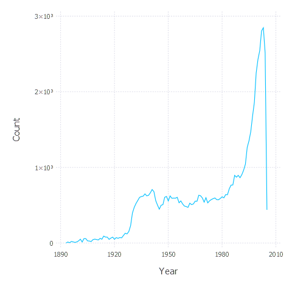
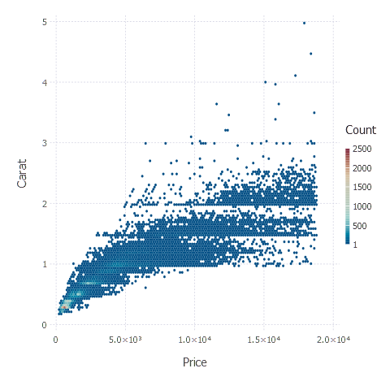
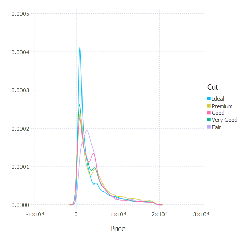
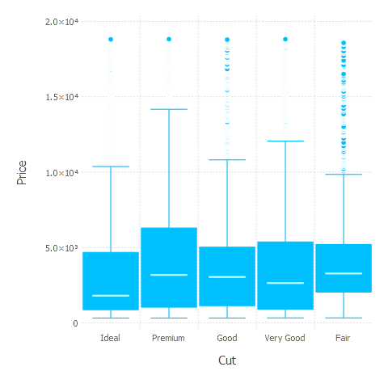
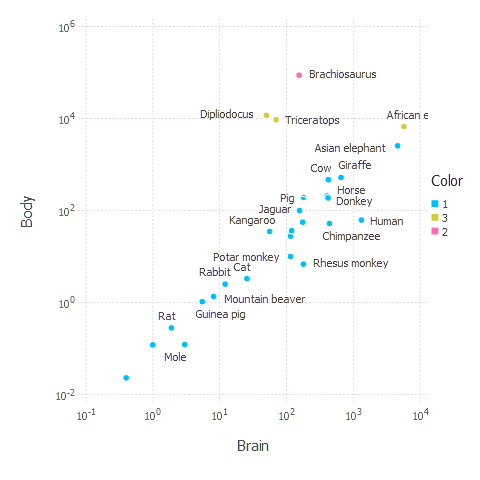

Julia for Data Science
================

Exploring JULIA's power in doing Data Science ...
-------------------------------------------------

### <https://julialang.org/>

#### What is and Why Julia ?!

###### Julia is a high-level general-purpose dynamic programming language, that was originally designed to address the needs of high-performance numerical analysis and computational science, without the typical need of separate compilation to be fast.

###### Julia is FAST. Julia was designed from the beginning for high performance and GPU acceleration. It's General, Dyamic and fast-growing, its community is expanding magnificently.

##### One beautiful thing about Julia is that its syntax resembles that of R. and as an R lover, I have begun to love Julia ...

Here we're going to explore some of what can be done in Data Science with Julia.

First we need to install and load some Julia Packages.

``` julia
Pkg.add("DataFrames")
Pkg.add("Query")
# .....

using DataFrames, Query, Knet, Gadfly,
  Cairo, Clustering, RDatasets
```

### Exploring, Manipulating and Visualizing Data

Julia has a data structure called [**DataFrame**](http://juliadata.github.io/DataFrames.jl/stable/index.html) which is similar to R's and pandas' data frame. Julia's DataFrame behaves in the same way as other languages dataframes with method for slicing, changing, reshaping etc. and has a package called [**Query**](http://www.queryverse.org/Query.jl/stable/) that can be used to manipulate it with **SQL**-like syntax. Query is very beautiful and it reminds me of R's **dplyr**. Julia also has [**Gadfly**](http://gadflyjl.org/stable/index.html) which is a package built on top of **R's ggplot2** that can be used for data visualization.

###### We will use some R datasets to explore them.

Creating a DataFrame ...

``` julia
Uefa_Goalscorers = DataFrame(Player = ["Cristiano Ronaldo", "Lionel Messi", "Raul Gonzalez"], 
               Goals = [120, 100, 71])
Uefa_Goalscorers
# 
# │ Row │ Player            │ Goals │
# ├─────┼───────────────────┼───────┤
# │ 1   │ Cristiano Ronaldo │ 120   │
# │ 2   │ Lionel Messi      │ 100   │
# │ 3   │ Raul Gonzalez     │ 71    │

describe(Uefa_Goalscorers)
# 2×8 DataFrames.DataFrame
# │ Row │ variable │ mean │ min               │ median │ max           │ nunique │ nmissing │ eltype │
# ├─────┼──────────┼──────┼───────────────────┼────────┼───────────────┼─────────┼──────────┼────────┤
# │ 1   │ Player   │      │ Cristiano Ronaldo │        │ Raul Gonzalez │ 3       │          │ String │
# │ 2   │ Goals    │ 97.0 │ 71                │ 100.0  │ 120           │         │          │ Int64  │
```

Using some of DataFrame functionalities ...

``` julia
Movies = dataset("ggplot2", "movies")
size(Movies)
# (58788, 24)
names(Movies)
# :Title
# :Year
# :Length
# ...
# :Romance
# :Short

Movies2 = delete!(Movies, 
                  [:Budget, :Length, :R1, :R2, :R3, :R4, :R5,
                   :R6, :R7, :R8, :R9, :R10, :MPAA])
head(Movies2, 3)
# 3×11 DataFrames.DataFrame
# │ Row │ Title                    │ Year │ Rating │ Votes │ Action │ Animation │ Comedy │ Drama │ Documentary │ Romance │ Short │
# ├─────┼──────────────────────────┼──────┼────────┼───────┼────────┼───────────┼────────┼───────┼─────────────┼─────────┼───────┤
# │ 1   │ $                        │ 1971 │ 6.4    │ 348   │ 0      │ 0         │ 1      │ 1     │ 0           │ 0       │ 0     │
# │ 2   │ $1000 a Touchdown        │ 1939 │ 6.0    │ 20    │ 0      │ 0         │ 1      │ 0     │ 0           │ 0       │ 0     │
# │ 3   │ $21 a Day Once a Month   │ 1941 │ 8.2    │ 5     │ 0      │ 1         │ 0      │ 0     │ 0           │ 0       │ 1     │

Movies3 = stack(Movies2, 5:11)

head(Movies3, 3)
# 3×6 DataFrames.DataFrame
# │ Row │ variable │ value │ Title                  │ Year │ Rating │ Votes │
# ├─────┼──────────┼───────┼────────────────────────┼──────┼────────┼───────┤
# │ 1   │ Action   │ 0     │ $                      │ 1971 │ 6.4    │ 348   │
# │ 2   │ Action   │ 0     │ $1000 a Touchdown      │ 1939 │ 6.0    │ 20    │
# │ 3   │ Action   │ 0     │ $21 a Day Once a Month │ 1941 │ 8.2    │ 5     │

tail(Movies3, 3)
# 3×6 DataFrames.DataFrame
# │ Row │ variable │ value │ Title                   │ Year │ Rating │ Votes │
# ├─────┼──────────┼───────┼─────────────────────────┼──────┼────────┼───────┤
# │ 1   │ Short    │ 0     │ www.hellssoapopera.com  │ 1999 │ 6.6    │ 5     │
# │ 2   │ Short    │ 0     │ xXx                     │ 2002 │ 5.5    │ 18514 │
# │ 3   │ Short    │ 0     │ xXx: State of the Union │ 2005 │ 3.9    │ 1584  │

categorical!(Movies3, :variable)
rename!(Movies3, :variable => :Genre)
sort!(Movies3, :Year)

# 411516×6 DataFrames.DataFrame
# │ Row    │ Genre        │ value │ Title                           │ Year │ Rating │ Votes │
# ├────────┼──────────────┼───────┼─────────────────────────────────┼──────┼────────┼───────┤
# │ 1      │ :Action      │ 0     │ Blacksmith Scene                │ 1893 │ 7.0    │ 90    │
# │ 2      │ :Animation   │ 0     │ Blacksmith Scene                │ 1893 │ 7.0    │ 90    │
# │ 3      │ :Comedy      │ 0     │ Blacksmith Scene                │ 1893 │ 7.0    │ 90    │

by(Movies3[Movies3[:value] .> 0, :], :Genre) do df
          DataFrame(MeanRating = mean(df[:Rating]), N = size(df, 1))
       end
# 7×3 DataFrames.DataFrame
# │ Row │ Genre        │ MeanRating │ N     │
# ├─────┼──────────────┼────────────┼───────┤
# │ 1   │ :Short       │ 6.48142    │ 9458  │
# │ 2   │ :Documentary │ 6.65058    │ 3472  │
# │ 3   │ :Comedy      │ 5.95549    │ 17271 │
# │ 4   │ :Drama       │ 6.15368    │ 21811 │
# │ 5   │ :Animation   │ 6.58369    │ 3690  │
# │ 6   │ :Action      │ 5.29202    │ 4688  │
# │ 7   │ :Romance     │ 6.164      │ 4744  │
```

Use **Query** package ...

``` julia
# Renove redundant rows
Movies4 = @from i in Movies3 begin
    @where i.value > 0
    @select i
    @collect DataFrame
end
# Group data by Year and get number of movies per year
Movies4 = @from i in Movies4 begin
    @group i by i.Year into g
    @select {Year = g.key, Count = length(g)}
    @collect DataFrame
end

size(Movies4)
# (113, 2)
head(Movies4, 3)
# 3×2 DataFrames.DataFrame
# │ Row │ Year │ Count │
# ├─────┼──────┼───────┤
# │ 1   │ 1893 │ 1     │
# │ 2   │ 1894 │ 14    │
# │ 3   │ 1895 │ 5     │
```

As we can see, Julia's DataFrame with the Query package are so powerful ... Now let's plot some plots using **Gadfly**

``` julia
plot(Movies4, x = :Year, y = :Count, Geom.line)
```



It really looks like **ggplot2** !!! Let's do some more visualizations ...

``` julia
diamonds = dataset("ggplot2", "diamonds")
plot(diamonds, x = :Price, y = :Carat, Geom.hexbin)
```



``` julia
plot(diamonds, x = :Price, color = :Cut, Geom.density)
```



``` julia
plot(diamonds, x = :Cut, y = :Price, Geom.boxplot)
```



And we can even do more with Gadfly ... Now as we have looked at data exploration, transformation and visualization, let's look at some important aspect of Data Science **Machine Learning** Julia has so many projects and packages to do Machine Learning and Deep Learning as well. Here we're going to talk about three of them ...

First [**Knet**](https://github.com/denizyuret/Knet.jl). In Knet every model consists of a predict function and a loss function that the model tries to minimize. What I like about Knet is that it makes me specify the model/algorithm equation at first, which makes me understand the algorithms better. Let's do a linear regression model using House Price data.

``` julia
## Get the data
House = readtable("home_data-train .csv", separator = ',', header = false)
# remove the first two columns as they're not important
delete!(House, [:x1, :x2])
# examine correlation to select variables 
cor(convert(Array, House))
# Get x, y
excluded = [3, 7, 11, 14, 15, 16, 17, 18, 19, 20]
unnecessary = [Symbol("x$i") for i in excluded]
x = House[setdiff(names(House), unnecessary)]
# Convert x to a matrix
x = convert(Array, x)'
# Scale x
x = x ./ sum(x, 1)
y = House[:x3]'
y = [log10(i) for i in y] # log y 
## TRAIN THE MODEL
using Knet
predict(w, x) = w[1]*x .+ w[2] # linear regression equation ax + b
loss(w, x, y) = mean(abs2, y-predict(w, x)) # mean error
lossgradient = grad(loss) # lossgradient returns dw, the gradient of the loss 

function train(w, data; lr=.1) # lr learning rate
    for (x,y) in data
        dw = lossgradient(w, x, y)
    for i in 1:length(w)
        w[i] -= lr * dw[i]
    end     
    end
    return w
end

w = Any[0.1 * randn(1, 9), 0.0 ] # 9 variables

for i = 1:10; train(w, [(x, y)]); println(loss(w, x, y)); end
# 15.747867259203675
# 7.728037219389701
# .....
# 0.19558043796561383
# 0.1697502328566464
```

Look how the loss was being minimized throughout the learning process.

It can look a little bit confusing but believe me it's straightforward. Try to look at the Knet project tutorials <https://github.com/denizyuret/Knet.jl> and it will become clearer.

Now let's evaluate the model comparing the predicted values with the actual one.

``` julia
## First let's look at every variable cofficient and the intercept

w[1]
# 1×9 Array{Float64,2}:
#  -0.0188016  -0.148975  0.810052  0.0934263  0.149106  0.100036  -0.0526069  0.430641  2.39719

w[2]
# 3.6645523063680914

## Now the actual y

y
# 5.34616  5.73078  5.25527  5.78104  5.70757 ...

yhat = w[1] * x .+ w[2]
# 5.53536  5.38548  5.77452  5.41222  5.50971 ...

#### N.B. they're logged numbers to return them to actual do (10 ^ y)
```

The model looks good ...

###### For more information on Linear Regression on House Pricing Data, Visit <https://mnoorfawi.github.io/Linear_Regression_with_R_caret/>

No let's look at **CLUSTERING** and how it can be done with Julia.

``` julia
Animals = dataset("MASS", "Animals")
using Clustering

feature_matrix = permutedims(convert(Array, Animals[:, 2:3]), 
                             [2, 1]) # to convert it to matrix
feature_matrix = collect(Missings.replace(feature_matrix, 0.0)) # to replace missings
model = kmeans(feature_matrix, 3) # 3 clusters           

## Plotting clusters
plot(Animals, x = :Brain, y = :Body, 
     color = categorical(model.assignments), label = :Species, 
     Geom.point, Geom.label, Scale.x_log10, Scale.y_log10)
```



This is straightforward ...

There are so many other packages that can be used to do Machine Learning with Julia, such as [**DecisionTree**](https://github.com/bensadeghi/DecisionTree.jl), [**ScikitLearn.jl**](https://scikitlearnjl.readthedocs.io/en/latest/), [**Flux**](https://github.com/FluxML/Flux.jl) and others.

Now we have looked at a little bit of what Julia can do in Data Science. Julia is a great language and its suntax is so beautiful and it is so powerful in doing math operations. It is almost as fast as C++. And above all it is easy to learn as it resembles R and Python in so many aspects.

Finally, **JULIA** is a great tool to add to your Data Science toolkit ...
